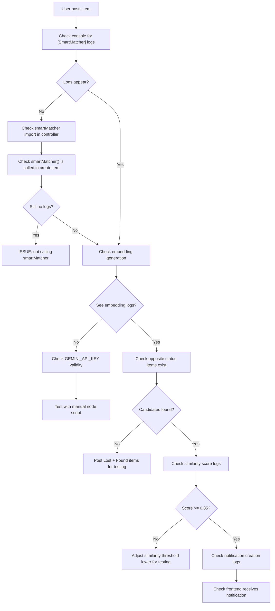

# Smart Matcher Troubleshooting Guide

## Did it get installed correctly?

### 1. Check if smartMatcher.js exists
```bash
# In the backend directory
ls -la utils/smartMatcher.js
# or on Windows
dir utils\smartMatcher.js
```

### 2. Check if it's imported in item.controller.js
```bash
grep -n "smartMatcher" backend/controllers/item.controller.js
```

You should see:
```javascript
const { smartMatcher } = require('../utils/smartMatcher');
```

### 3. Check if it's called in createItem
```bash
grep -n "smartMatcher(" backend/controllers/item.controller.js
```

## Testing the Smart Matcher

### Step 1: Add Logging to Backend

Edit `backend/index.js` and ensure logging is enabled:

```javascript
// Add this near the top
console.log('Starting Reunite Backend Server...');
console.log('Environment:', process.env.NODE_ENV || 'development');
console.log('GEMINI_API_KEY configured:', !!process.env.GEMINI_API_KEY);
console.log('MONGODB_URI configured:', !!process.env.MONGODB_URI);
```

### Step 2: Test Manual Endpoint (Optional)

Add a test endpoint temporarily:

```javascript
// At the end of backend/routes/item.routes.js

// Test endpoint (REMOVE AFTER TESTING)
router.post('/test-smart-matcher', authMiddleware.authenticate, async (req, res) => {
  try {
    console.log('[TEST] Smart Matcher endpoint called');
    const { smartMatcher } = require('../utils/smartMatcher');
    const Item = require('../models/item.model');
    
    const testItem = await Item.findOne({ isActive: true });
    if (!testItem) {
      return res.status(404).json({ message: 'No items found to test' });
    }
    
    console.log('[TEST] Testing with item:', testItem.title);
    await smartMatcher(testItem, req.app.get('io'));
    
    res.json({ message: 'Smart matcher test triggered', item: testItem.title });
  } catch (error) {
    res.status(500).json({ message: 'Test failed', error: error.message });
  }
});
```

Then test with curl:
```bash
curl -X POST http://localhost:5000/items/test-smart-matcher \
  -H "Authorization: your_token_here" \
  -H "Content-Type: application/json"
```

### Step 3: Check Backend Logs

Start the backend and look for:

```
[SmartMatcher] Generating embedding for item: "Your Item Title"
[SmartMatcher] Embedding generated, dimension: 768
[SmartMatcher] Looking for Found items to match against
[SmartMatcher] Found X candidates to check
```

If you don't see these logs, the smartMatcher isn't being called.

## Common Issues & Solutions

### Issue 1: "No embedding generated"

**Cause**: GEMINI_API_KEY is invalid or the API structure changed

**Solution**:
```bash
# Verify API key is set
grep GEMINI_API_KEY .env

# Test the Gemini API directly
node << 'EOF'
const { GoogleGenerativeAI } = require("@google/generative-ai");
const genAI = new GoogleGenerativeAI(process.env.GEMINI_API_KEY);

async function test() {
  try {
    const model = genAI.getGenerativeModel({ model: "embedding-001" });
    const result = await model.embedContent("test laptop");
    console.log('✅ Embedding API Works!');
    console.log('Response structure:', Object.keys(result));
    console.log('Embedding values type:', typeof result.embedding);
  } catch (error) {
    console.error('❌ Embedding API Failed:', error.message);
  }
}
test();
EOF
```

### Issue 2: "No opposite status items found"

**Cause**: Database doesn't have both Lost and Found items, or the query is wrong

**Solution**:
```bash
# Check items in MongoDB
mongo << 'EOF'
use reunite
db.items.find({ status: "Lost" }).count()      // Count Lost items
db.items.find({ status: "Found" }).count()     // Count Found items
EOF
```

**To test**: Make sure you have:
- At least 1 item with status: "Lost"
- At least 1 item with status: "Found"

### Issue 3: "Failed to send notifications"

**Cause**: Socket.io not initialized or users not connected

**Solution**:
```javascript
// In backend/index.js, verify socket.io is set up:
const io = require('socket.io')(server, {
  cors: { origin: process.env.FRONTEND_URL, credentials: true }
});

app.set('io', io);  // ← This line is critical!

io.on('connection', (socket) => {
  console.log('User connected:', socket.id);
});
```

### Issue 4: "Notifications created but not visible in frontend"

**Cause**: Frontend not listening for 'newNotification' event

**Solution**: Check `frontend/src/hooks/useNotifications.js`:
```javascript
useEffect(() => {
  const socket = socketInstance;
  
  socket.on('newNotification', (notification) => {
    console.log('[useNotifications] Received notification:', notification);
    // Should see this in browser console
  });
  
  return () => socket.off('newNotification');
}, []);
```

## Step-by-Step Debugging Flow



## Enable Detailed Logging

Edit `backend/utils/smartMatcher.js` and uncomment all console.log statements to see detailed debug info:

```javascript
console.log('[SmartMatcher] Starting matcher...');
console.log('[SmartMatcher] New item title:', newItem.title);
console.log('[SmartMatcher] Found candidates:', candidateItems.length);
// ... more logs
```

Then watch backend logs in real-time:

```bash
npm start 2>&1 | grep SmartMatcher
```

## Performance Check

If matches are found but slow:

```javascript
// Add timing to smartMatcher
const startTime = Date.now();
// ... matching logic ...
const duration = Date.now() - startTime;
console.log(`[SmartMatcher] Completed in ${duration}ms`);
```

Typical times:
- Single embedding: 500-1000ms
- 10 candidates: 5-10 seconds
- 50 candidates: 25-50 seconds

If slower, consider:
- Limiting candidates: `.limit(20)` instead of 50
- Caching embeddings in database
- Running matcher asynchronously (already done)

## Database Query Verification

```bash
# SSH into MongoDB Atlas and run:
db.items.find({
  _id: { $ne: ObjectId("...") },
  status: "Found",
  isActive: true
}).limit(5)
```

## Final Verification Checklist

- [ ] `.env` has valid `GEMINI_API_KEY`
- [ ] `.env` has valid `MONGODB_URI` (MongoDB Atlas connection string)
- [ ] `MONGODB_URI` password doesn't have special characters (or is URL-encoded)
- [ ] Backend starts without errors
- [ ] You can create items successfully
- [ ] At least 1 Lost item and 1 Found item exist
- [ ] Backend logs show `[SmartMatcher]` messages
- [ ] No errors in browser console
- [ ] Socket.io is connected (check Network tab in DevTools)

If all checks pass but Still not working → Post the backend logs here and share the exact error/behavior!

---

**Pro Tip**: For testing, temporarily set threshold to 0.70 to see if notifications work at all:

```javascript
const MATCH_THRESHOLD = 0.70; // Change from 0.85
```

Then gradually increase back to 0.85 once working.
